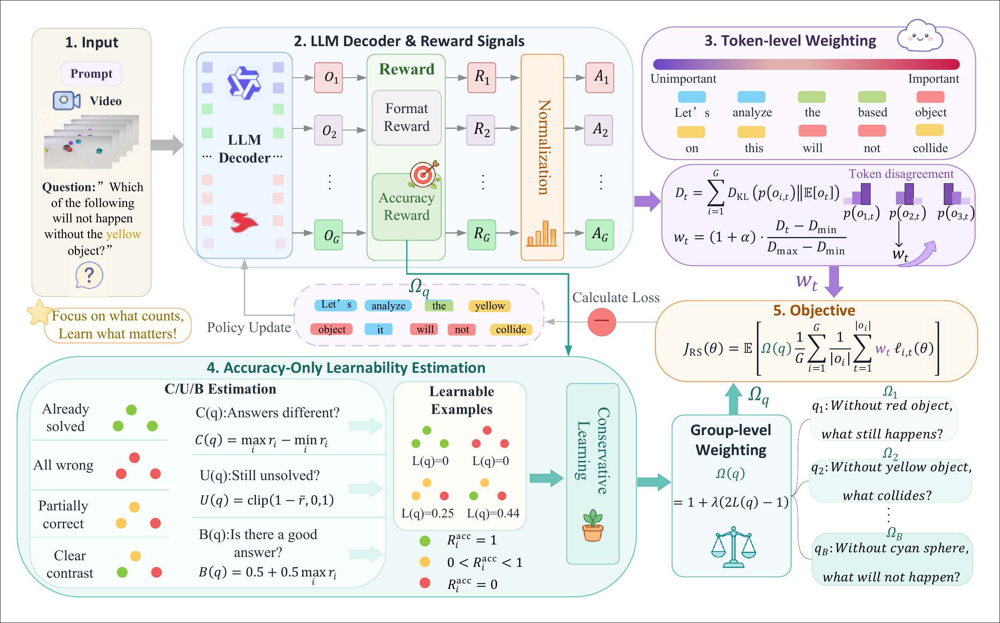
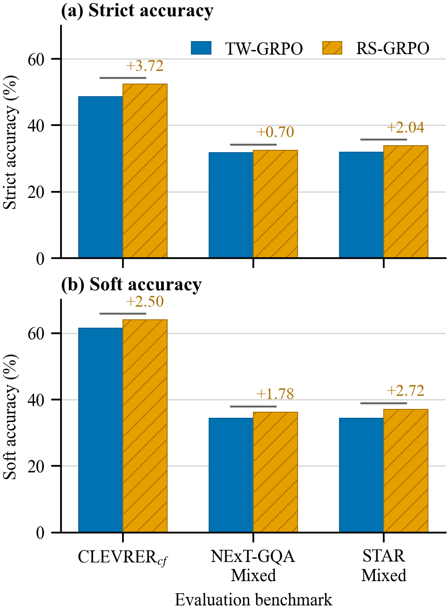
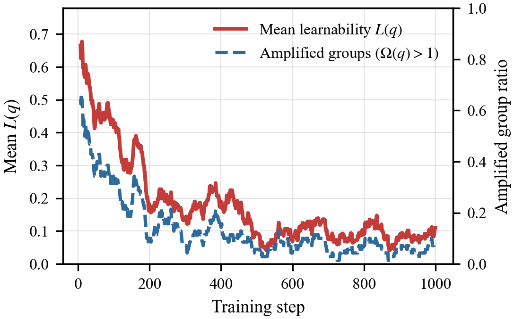
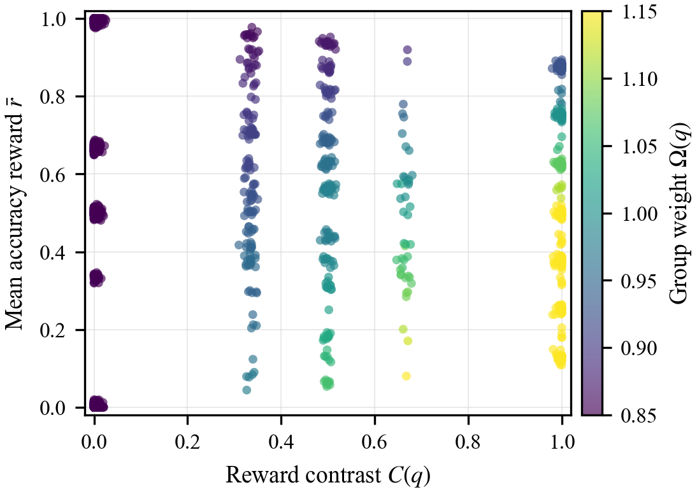

# RS-GRPO: Reward-Separable GRPO for Video Reasoning

[](https://www.python.org/)
[](LICENSE)
[](https://huggingface.co/Qwen/Qwen2.5-VL-7B-Instruct)

This repository provides the official code for **Reward-Separable Group Relative Policy Optimization (RS-GRPO)**, a lightweight group-level reweighting extension of TW-GRPO for multi-answer video reasoning.

RS-GRPO keeps TW-GRPO token-level weighting and adds an accuracy-driven prompt-group weight. The implementation includes switches for GRPO, TW-GRPO, RS-GRPO, DAPO-style filtering, LIMR-style data selection, Dr. GRPO, and GSPO-style sequence-level optimization.

## Method Overview

<p align="center">
  
</p>

RS-GRPO estimates prompt-group learnability from answer-quality rewards only. Groups with clear reward contrast, remaining room for improvement, and at least one high-quality response receive larger weights, while all-wrong, already solved, or low-contrast groups are conservatively down-weighted.

## Highlights

| Component | Purpose |
| --- | --- |
| Reward-separable learnability | Estimates group usefulness from answer correctness instead of mixed format rewards. |
| Conservative group weighting | Uses a bounded group weight, so no prompt group is discarded. |
| Token + group allocation | Combines TW-GRPO token-level weighting with prompt-group weighting. |
| Lightweight training | Adds only scalar group statistics after reward computation, with no extra rollout or reward model. |

## Results Snapshot

| Method | CLEVRER Strict | CLEVRER Soft | NExT-GQA-Mixed Strict | NExT-GQA-Mixed Soft | STAR-Mixed Strict | STAR-Mixed Soft |
| --- | ---: | ---: | ---: | ---: | ---: | ---: |
| TW-GRPO | 48.65 | 61.53 | 31.70 | 34.37 | 31.83 | 34.37 |
| RS-GRPO | **52.37** | **64.03** | **32.40** | **36.15** | **33.87** | **37.09** |

<p align="center">
  
</p>

## Learnability Analysis

<p align="center">
  
  
</p>

The learnability signal is highest when the policy produces mixed correct and incorrect responses for the same prompt. As training proceeds, more groups become stable, and the amplified-group ratio naturally decreases.

## Repository Structure

```text
RS-GRPO/
+-- src/
|   +-- open_r1/                 # training entry and trainer implementation
|   +-- eval/                    # video QA evaluation scripts
+-- scripts/
|   +-- rs-grpo.sh               # unified training script
|   +-- evaluate_*.sh            # evaluation helpers
|   +-- zero*.json / zero*.yaml  # DeepSpeed configs
+-- configs/                     # accelerate/deepspeed configs
+-- data/
|   +-- CLEVRER/                 # CLEVRER placeholders
|   +-- NExTQA/                  # NExT-QA/NExT-GQA video placeholders
|   +-- STAR/                    # STAR video placeholders
|   +-- evaluation/              # evaluation JSON placeholders
|   +-- question_answer_inverse/ # QAI construction scripts
+-- docs/images/                 # figures used by this README
+-- example/                     # QAI tutorial
+-- qwen-vl-utils/               # local Qwen-VL utility package
+-- setup.py
+-- LICENSE
```

Large assets are intentionally excluded: model checkpoints, logs, generated build files, real dataset JSON files, and videos.

## Environment

```bash
git clone https://github.com/just-a-go/RS-GRPO.git
cd RS-GRPO

conda create -n rs-grpo python=3.10 -y
conda activate rs-grpo

pip install -e ".[dev]"
pip install flash_attn --no-build-isolation
pip install decord

cd qwen-vl-utils
pip install -e .
cd ..
```

The training scripts assume a Linux server with CUDA, PyTorch, Transformers, TRL, Accelerate, and DeepSpeed.

## Model Backbone

Download Qwen2.5-VL-7B-Instruct:

```bash
mkdir -p Qwen
huggingface-cli download Qwen/Qwen2.5-VL-7B-Instruct \
  --local-dir Qwen/Qwen2.5-VL-7B-Instruct \
  --resume-download
```

Optional baseline checkpoint:

```bash
huggingface-cli download Video-R1/Video-R1-7B \
  --local-dir Qwen/Qwen2.5-VL-Video-R1-7B \
  --resume-download
```

Other baseline checkpoints can be placed under `Qwen/` if you want to reproduce every comparison row. They are not required for RS-GRPO training.

## Released Checkpoint

The retained CLEVRER run checkpoint is stored at:

```text
Qwen2.5-VL-7B-Instruct_clevrer_acclearn_twgrpo_lam015_tau05/checkpoint-1000/
```

The earlier `checkpoint-900` snapshot was removed. Model weight shards are re-sharded into GitHub-LFS-compatible files and tracked with Git LFS, so run `git lfs pull` after cloning if the large files are not downloaded automatically.

## Dataset Preparation

Only folder placeholders are included. Download each original dataset separately and place files under the paths expected by the scripts.

### CLEVRER Counterfactual

Expected structure:

```text
data/CLEVRER/
+-- clevrer_counterfactual_train.json
+-- clevrer_counterfactual_val.json
+-- train_video/
+-- validation_video/
```

Download CLEVRER videos from the official release and put training videos in `train_video/` and validation videos in `validation_video/`.

### NExT-GQA-Mixed and STAR-Mixed

Expected evaluation structure:

```text
data/evaluation/
+-- eval_nextgqa_mixed_server.json
+-- eval_star_mixed_server.json
```

Suggested video structure:

```text
data/NExTQA/
+-- videos/
|   +-- <video_id>.mp4

data/STAR/
+-- <video_file>.mp4
```

The evaluation code reads the video path from each sample's `video` field. The JSON paths must point to your local video files. You can use absolute paths, symlinks, or rewrite the JSON `video` fields to the suggested local layout.

To construct mixed multi-answer data, use the QAI scripts:

```bash
python data/question_answer_inverse/convert_nextgqa.py
python data/question_answer_inverse/convert_star.py
```

See `example/tutorial/qai_tutorial.md` for the QAI data construction idea.

## Training

Set paths first:

```bash
export PRIVATE_DATA_ROOT=/path/to/RS-GRPO
export MODEL_PATH=$PRIVATE_DATA_ROOT/Qwen/Qwen2.5-VL-7B-Instruct
export JSONL_PATH=$PRIVATE_DATA_ROOT/data/CLEVRER/clevrer_counterfactual_train.json
export CUDA_VISIBLE_DEVICES=0,1
export NPROC_PER_NODE=2
```

Run the default RS-GRPO setting:

```bash
LOSS_TYPE=rs_grpo \
MODEL_NAME=Qwen2.5-VL-7B-Instruct_clevrer_rs_grpo \
bash scripts/rs-grpo.sh
```

Available methods:

```bash
LOSS_TYPE=grpo      bash scripts/rs-grpo.sh
LOSS_TYPE=tw_grpo   bash scripts/rs-grpo.sh
LOSS_TYPE=rs_grpo   bash scripts/rs-grpo.sh
LOSS_TYPE=dapo      bash scripts/rs-grpo.sh
LOSS_TYPE=limr      bash scripts/rs-grpo.sh
LOSS_TYPE=dr_grpo   bash scripts/rs-grpo.sh
LOSS_TYPE=gspo      bash scripts/rs-grpo.sh
```

DAPO, LIMR, Dr. GRPO, and GSPO are implemented on top of the GRPO branch and do not use TW token weighting. TW-GRPO and RS-GRPO use token-level weighting.

## RS-GRPO Ablations

Learnability definition:

```bash
RS_LEARNABILITY_DEFINITION=full
RS_LEARNABILITY_DEFINITION=wo_contrast
RS_LEARNABILITY_DEFINITION=wo_unsolvedness
RS_LEARNABILITY_DEFINITION=wo_best_quality
RS_LEARNABILITY_DEFINITION=contrast_only
```

Group weighting rule:

```bash
RS_GROUP_WEIGHTING_RULE=hard_filter
RS_GROUP_WEIGHTING_RULE=binary_up
RS_GROUP_WEIGHTING_RULE=amplify_only
RS_GROUP_WEIGHTING_RULE=conservative
```

Reward source for estimating group learnability:

```bash
RS_REWARD_SOURCE=accuracy  # accuracy reward only
RS_REWARD_SOURCE=total     # accuracy + format reward
```

Hyperparameters:

```bash
RS_LEARNABLE_LAMBDA=0.15
RS_LEARNABLE_TAU=0.5
MAX_COMPLETION_LENGTH=2048
NUM_GENERATIONS=8
```

Example:

```bash
LOSS_TYPE=rs_grpo \
RS_LEARNABILITY_DEFINITION=full \
RS_GROUP_WEIGHTING_RULE=conservative \
RS_REWARD_SOURCE=accuracy \
RS_LEARNABLE_LAMBDA=0.15 \
RS_LEARNABLE_TAU=0.5 \
MODEL_NAME=Qwen2.5-VL-7B-Instruct_clevrer_rs_full \
bash scripts/rs-grpo.sh
```

## Evaluation

### CLEVRER

```bash
export PRIVATE_DATA_ROOT=/path/to/RS-GRPO
export EVAL_OUTPUT_ROOT=$PRIVATE_DATA_ROOT
export CLEVRER_VAL_PATH=$PRIVATE_DATA_ROOT/data/CLEVRER/clevrer_counterfactual_val.json
export CUDA_VISIBLE_DEVICES=0,1
export BATCH_SIZE=4

bash scripts/evaluate_clevrer_main_baselines.sh
```

Evaluate a trained RS-GRPO checkpoint:

```bash
python src/eval/eval_clevrer.py \
  --model_name /path/to/checkpoint \
  --batch_size 4
```

### NExT-GQA-Mixed

```bash
export PRIVATE_DATA_ROOT=/path/to/RS-GRPO
export EVAL_OUTPUT_ROOT=$PRIVATE_DATA_ROOT
export CUDA_VISIBLE_DEVICES=0,1
export BATCH_SIZE=4
export DATASET_NAME=eval_nextgqa_mixed_server

bash scripts/evaluate_general_main_baselines.sh
```

Evaluate an RS-GRPO checkpoint:

```bash
python src/eval/eval_general_videor1.py \
  --model_name /path/to/checkpoint \
  --dataset_name eval_nextgqa_mixed_server \
  --batch_size 4
```

### STAR-Mixed

```bash
export PRIVATE_DATA_ROOT=/path/to/RS-GRPO
export EVAL_OUTPUT_ROOT=$PRIVATE_DATA_ROOT
export CUDA_VISIBLE_DEVICES=0,1
export BATCH_SIZE=2
export DATASET_NAME=eval_star_mixed_server

bash scripts/evaluate_general_main_baselines.sh
```

Evaluate an RS-GRPO checkpoint:

```bash
python src/eval/eval_general_videor1.py \
  --model_name /path/to/checkpoint \
  --dataset_name eval_star_mixed_server \
  --batch_size 2
```

Evaluation logs are written to:

```text
logs/<dataset_name>/test/<model_name>/
```

## Reproduction Notes

- Use the same base model, dataset split, group size, maximum completion length, and checkpoint selection when comparing methods.
- `evaluate_general_main_baselines.sh` evaluates baseline models only. It does not evaluate RS-GRPO or TW-GRPO checkpoints.
- For NExT-GQA-Mixed and STAR-Mixed, use checkpoints trained on the corresponding training data for in-domain results. A CLEVRER-trained checkpoint is a cross-dataset transfer setting.
- The default script uses `WANDB_MODE=offline`; change it if you want online logging.
- If your server has a different directory layout, set `PRIVATE_DATA_ROOT`, `MODEL_PATH`, and `JSONL_PATH` explicitly before launching training.

## Citation

If this repository helps your research, please cite the RS-GRPO paper once available.

```bibtex
@article{rsgrpo2026,
  title  = {Reward-Separable GRPO: Enhancing Video Reasoning by Focusing on Learnable Prompt Groups},
  author = {Dang, Jisheng and Wang, Weiqi and Zhang, Wencan and others},
  year   = {2026}
}
```

## Acknowledgements

This codebase is adapted from TW-GRPO and Open-R1-style training code. It also uses the local `qwen-vl-utils` package for Qwen-VL video processing.
